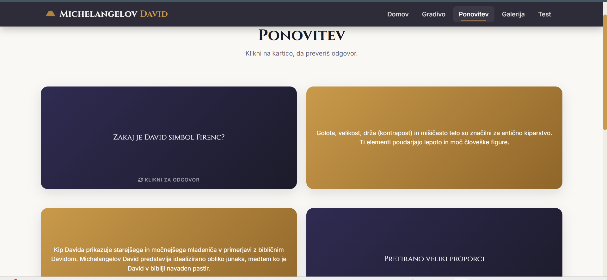
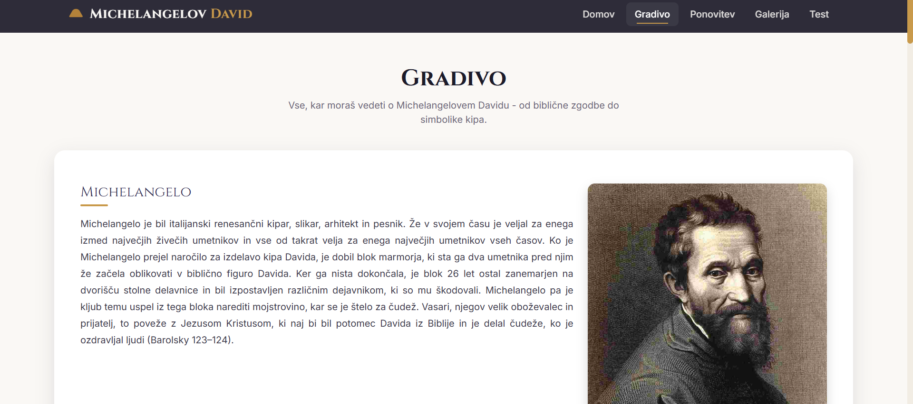
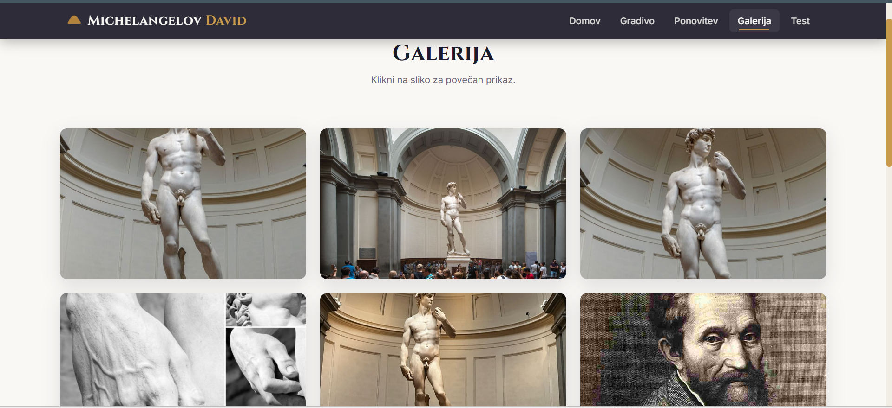
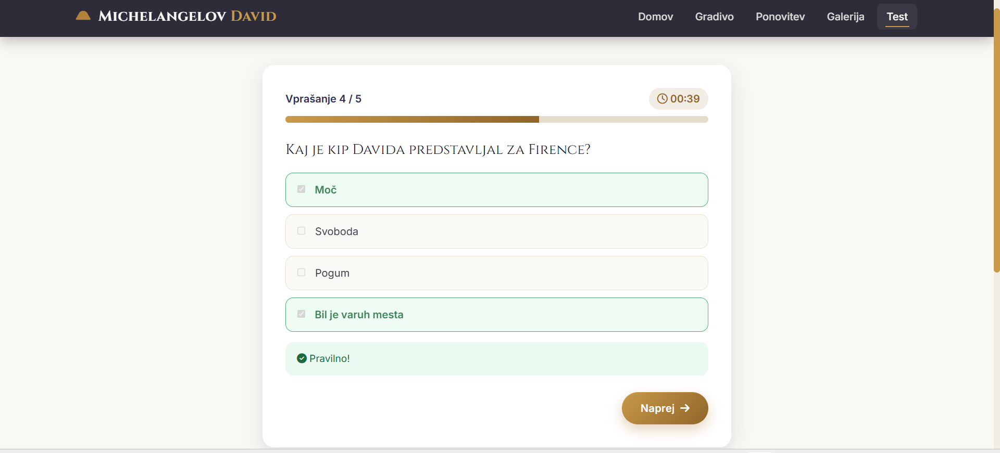
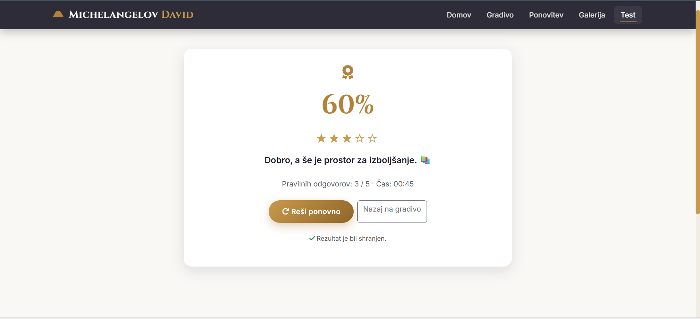

# 🏛️ Michelangelov David – Interaktivna spletna učilnica

Interaktivna spletna aplikacija za spoznavanje znamenite Michelangelove skulpture **David**. Uporabnik lahko prebere učno gradivo, si ogleda galerijo, ponovi pridobljeno znanje z interaktivnim kvizom ter prejme takojšnjo povratno informacijo o svojih odgovorih. Rezultati se shranjujejo v podatkovno bazo MySQL.

---

## ✨ Funkcionalnosti

* 📖 Interaktivno učno gradivo o Michelangelovem kipu David.
* 🖼️ Galerija slik.
* 📝 Kviz s štirimi vrstami vprašanj:

  * **Select** – izbira odgovora iz spustnega seznama.
  * **Radio** – izbira enega pravilnega odgovora.
  * **Checkbox** – izbira več pravilnih odgovorov.
  * **Text** – vnos odgovora z besedilom.
* 💬 Takojšnja povratna informacija o pravilnosti odgovora.
* ⏱️ Merjenje časa reševanja in prikaz napredka.
* 💾 Shranjevanje rezultatov v podatkovno bazo MySQL.
* ➕ Dodajanje novih vprašanj v podatkovno bazo.
* ✏️ Urejanje obstoječih vprašanj.
* 🗑️ Brisanje vprašanj iz podatkovne baze.
* 🔒 Administratorski vmesnik za upravljanje vprašanj.
* 📱 Odzivna (Responsive) zasnova za računalnike, tablice in mobilne naprave.

---

## 🛠️ Uporabljene tehnologije

### Backend

* PHP (PDO)
* MySQL / MariaDB

### Frontend

* HTML5
* CSS3
* JavaScript (Vanilla JS)

### Orodja

* Apache (XAMPP)
* phpMyAdmin
* Git
* GitHub

---

## 📁 Struktura projekta

```text
Michelangelov-David/
│
├── admin/                          # Administratorski del aplikacije
│   ├── includes/                   # Skupne datoteke za administratorja
│   ├── dashboard.php               # Nadzorna plošča administratorja
│   ├── dodaj_vprasanje.php         # Dodajanje novih vprašanj v podatkovno bazo
│   ├── izbrisi.php                 # Brisanje vprašanj iz podatkovne baze
│   ├── login.php                   # Prijava administratorja
│   ├── logout.php                  # Odjava administratorja
│   ├── rezultati.php               # Pregled rezultatov uporabnikov
│   ├── setup.php                   # Začetna nastavitev administracije
│   ├── uredi_vprasanje.php         # Urejanje obstoječih vprašanj
│   └── vprasanja.php               # Seznam vseh vprašanj
│
├── assets/                         # Statične datoteke projekta
│   ├── css/
│   │   └── style.css               # Glavna slogovna datoteka
│   ├── images/                     # Slike uporabljene v aplikaciji
│   └── js/
│       ├── admin-question-form.js  # JavaScript za obrazec za vprašanja
│       ├── gallery.js              # Logika galerije slik
│       ├── quiz.js                 # Glavna logika kviza
│       └── script.js               # Splošne JavaScript funkcije
│
├── database/                       # Datoteke podatkovne baze
│   ├── .htaccess                   # Zaščita dostopa do mape
│   └── script.sql                  # SQL skripta za ustvarjanje baze in tabel
│
├── gallery/
│   └── galerija.php                # Stran z galerijo slik
│
├── includes/                       # Skupne datoteke aplikacije
│   ├── .htaccess                   # Zaščita mape
│   ├── config.php                  # Osnovne nastavitve aplikacije
│   ├── db.php                      # Povezava s podatkovno bazo (PDO)
│   ├── footer.php                  # Skupna noga strani
│   ├── header.php                  # Skupna glava strani
│   └── nav.php                     # Navigacijski meni
│
├── quiz/                           # Datoteke za delovanje kviza
│   ├── check.php                   # Preverjanje odgovorov uporabnika
│   ├── submit.php                  # Shranjevanje rezultatov kviza
│   └── test.php                    # Glavna stran kviza
│
├── gradivo1.php                    # Učno gradivo o Michelangelovem Davidu
├── index.php                       # Začetna (domača) stran aplikacije
├── ponovitev.php                   # Stran za ponovitev učne snovi
```
---

## ⚙️ Namestitev in zagon

### 1. Predpogoji

Pred zagonom projekta mora biti nameščeno:

* XAMPP (Apache + MySQL)
* PHP 7.4 ali novejši
* Git (neobvezno)

---

### 2. Kloniranje repozitorija

```bash
git clone https://github.com/Sarar-design/Michelangelov-David.git
```

ali prenesi ZIP datoteko in projekt razširi.

---

### 3. Kopiranje projekta

Projekt kopiraj v mapo:

```text
C:\xampp\htdocs\Michelangelov-David
```

---

### 4. Zagon strežnika

Odpri **XAMPP Control Panel** in zaženi:

* Apache
* MySQL

---

### 5. Ustvarjanje podatkovne baze

Odpri:

```text
http://localhost/phpmyadmin
```

Ustvari novo podatkovno bazo:

```text
michelangelo_quiz
```

Nato klikni **Import** in izberi datoteko:

```text
database/script.sql
```

---

### 6. Nastavitev povezave z bazo

V datoteki **includes/db.php** preveri naslednje nastavitve:

```php
$db_host = 'localhost';
$db_port = '3306';
$db_name = 'michelangelo_quiz';
$db_user = 'root';
$db_pass = '';
```

Če uporabljaš drugačen MySQL port ali geslo, podatke ustrezno prilagodi.

---

### 7. Nastavitev osnovne poti

V datoteki **includes/config.php** preveri:

```php
define('BASE_URL', '/Michelangelov-David/');
```

---

### 8. Zagon aplikacije

Odpri spletni brskalnik in obišči:

```text
http://localhost/Michelangelov-David/
```

ali neposredno kviz:

```text
http://localhost/Michelangelov-David/quiz/test.php
```

---

## 🎯 Uporaba

1. Preberi učno gradivo.
2. Oglej si galerijo.
3. Vnesi svoje ime.
4. Začni reševati kviz.
5. Odgovarjaj na vprašanja.
6. Po koncu se prikaže rezultat.
7. Rezultat se samodejno shrani v podatkovno bazo.
8. Dodaj in briši vprašanja in odgovore.

---

## 🗄️ Podatkovna baza

Projekt uporablja dve glavni tabeli.

### `vprasanja`

| Stolpec          | Opis                  |
| ---------------- | --------------------- |
| id               | Primarni ključ        |
| vprasanje        | Besedilo vprašanja    |
| tip              | Tip vprašanja         |
| odgovori         | JSON možnih odgovorov |
| pravilni_odgovor | Pravilen odgovor      |
| vrstni_red       | Vrstni red            |
| aktivno          | Aktivno vprašanje     |
| created_at       | Datum ustvarjanja     |

---

### `quiz_rezultati`

| Stolpec         | Opis                |
| --------------- | ------------------- |
| id              | Primarni ključ      |
| ime             | Ime uporabnika      |
| tocke           | Dosežene točke      |
| skupaj          | Število vprašanj    |
| odstotek        | Uspešnost           |
| cas_sekund      | Čas reševanja       |
| odgovori_json   | Odgovori uporabnika |
| submission_date | Datum oddaje        |

---

## 📸 Posnetki zaslona

| Domov | Ponovitev |
|---------|--------|
|  |  |

| Gradivo | Galerija |
|---------|--------------------|
|  |  |

| Test | Rezultati |
|------------|---------|
|  |  |


## 🎯 Nadaljnje izboljšave

* Administratorski CRUD za vprašanja.
* Statistika rezultatov z grafikoni.
* Izvoz rezultatov v PDF ali Excel.
* Večjezična podpora.
* Dodajanje slik in videoposnetkov k vprašanjem.
* Sistem za prijavo uporabnikov.

---

## 🐞 Znane težave

Če povezava z bazo ne deluje:

* preveri, da je MySQL zagnan,
* preveri nastavitve v `includes/db.php`,
* preveri, da obstaja baza **michelangelo_quiz**,
* ponovno uvozi datoteko `database/script.sql`.

---


## 👩‍💻 Avtor

Projekt je razvila **Sara Ribič** kot študijski projekt in projekt za osebni portfolio.


---
## 📄 Licenca

Ta projekt je namenjen izobraževalni uporabi in predstavitvi v portfoliu.  

---
## ⭐ Namen projekta

Projekt je bil izdelan kot študijski projekt za utrjevanje znanja razvoja spletnih aplikacij s tehnologijami PHP, MySQL, HTML, CSS in JavaScript. Prikazuje uporabo podatkovne baze, dela z obrazci, AJAX komunikacije, shranjevanja rezultatov ter razvoj odzivne spletne aplikacije.
